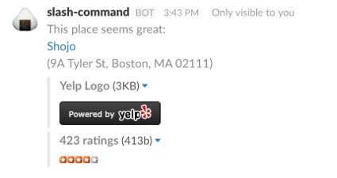

# Restaurant Bot for Slack

A simple web app to create a slack integration to find somewhere to eat lunch.
This is currently under development.

## Purpose

This Slack slash command will allow a Slack user to type `/lunch_idea` in to
Slack to get a random restaurant within a mile of an address provided in `ENV['ADDRESS']`.

This command uses the Yelp api to identify possible restaurants.
Because this is a fairly simple project with only one route with no views, I opted to use the more lightweight Sinatra framework rather than the more complex Rails.

## Setup

To setup this slack command:

1. Visit https://my.slack.com/services/new/slash-commands
2. Choose a name for the slack command (it must be one word) like `/lunch_idea`
3. Under integration settings, add https://obscure-eyrie-21980.herokuapp.com/ for the URL (this is where the code to make this run is hosted)
4. Change the method to "GET"
5. Modify the rest of the fields to your liking.
6. Click "Save Integration"

Then you should be setup to run the slash command and get your lunch idea.

The slack integration will return a restaurant (only ones that are open), and its rating, plus some other images required for using the Yelp API.

